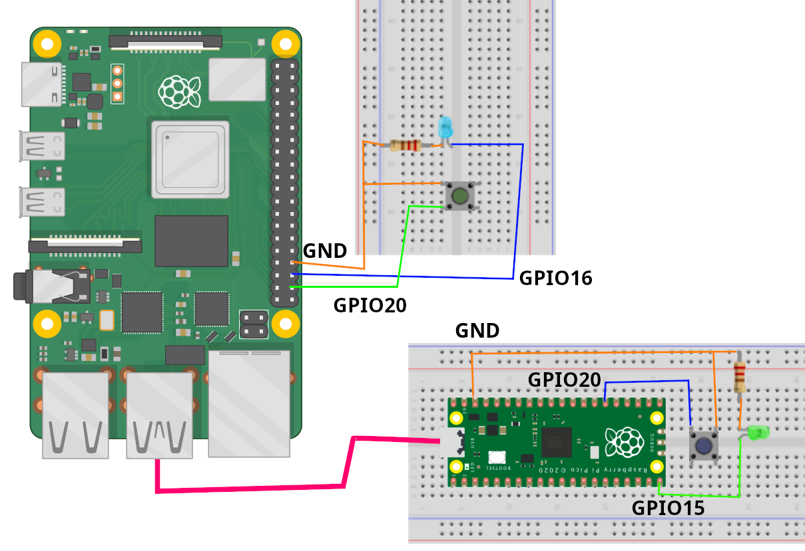

A Raspberry Pi Pico is connected to a Raspberry Pi SBC (single board computer). A button and LED are present at both ends. Pressing the button on one device lights up the LED on the other device by exchanging signal strings by using the serial interfaces at each end via USB.

I initially developed this for my other project at <a href="https://github.com/indiekiwi/raspberrypi-wigglegram-camera">raspberrypi-wigglegram-camera</a>, but it wasn’t included in the final design.

### Software Used
- Raspberry Pi 4  
  - Ubuntu Server 24.10 (64 bit)
  - python3-gpiozero
     - *May not need to install manually if using Raspberry Pi OS
- Raspberry Pi Pico
  - Circuit Python (no external libraries used)

## Build
<table>
  <tr>
    <th>Parts List</th>
    <th>Wiring Diagram</th>
  </tr>
  <tr>
    <td>
      <ul>
        <li>Raspberry Pi SBC (I developed it on a Raspberry Pi 4)</li>
        <li>Raspberry Pi Pico (rp2040 micro controller)</li>
        <li>2x LEDs</li>
        <li>2x Push Buttons</li>
        <li>2x 330ohm resistors</li>
        <li>2x Breadboards</li>
        <li>Breadboard wires</li>
        <li>Micro USB Data cable</li>
        <li>Power source for the SBC</li>
      </ul>
    </td>
    <td></td>
  </tr>
</table>

## Useful Commands
<table>
  <tr>
    <th>Desc</th>
    <th>Command</th>
  </tr>
  <tr>
    <td>Mount the pico to the raspberry pi sbc to modify pico code directly</td>
    <td>
      <code>sudo mkdir -p /mnt/pico;
sudo mount /dev/sda1 /mnt/pico</code>
    </td>
</td>
  </tr>
  <tr>
    <td>I had to run as root to access the GPIO pin</td>
    <td><code>sudo python3 sbc/code.py</code></td>
  </tr>
</table>
